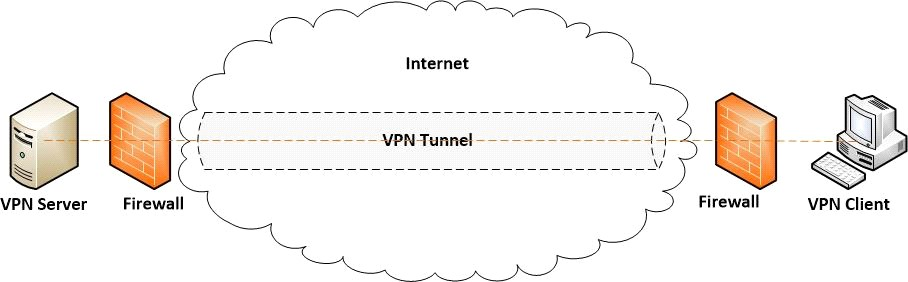

# Virtual Private Network (VPN)

## The Ultimate Guide to VPN Tunneling

- VPN uses process call tunneling that extends to private network across a public network.
- Tunneling is way of encrypting the data and keeping it separate from other traffic on the internet
- It helps with VPN to protect confidentiality and integrity across the tracking network.
- Never transmit data over public network
- VPN tunneling allows user to use public network and still securely transfer data from one device or network from one to other through a non-secure environment.
- Tunneling repackaging data into a different form
- `Data encapsulation` and encryption to safely carry data traffic through the non-secure environment 
- Encapsulation insulates the packet of data from other data traveling over the same network, while encryption makes data invisible (unreadable) even to surveillance agents and criminals
- VPN tunneling

- Encapsulation disguise the data so it won't be recognized as data with payload, while encryption make sure that even if the data packet is recognize no one can reach the cash inside.
- When choosing VPN its important to consider how you are thinking about you intends to use the service.
- `Kill switch` is a method of setup to monitor if there is any changes in your connection.
- if your connection is lost from your VPN server, it automatically stops your device or terminate specific app from connecting to the internet through your ISP.
- Splitting Tunneling let you gain access t web service of which you want or need the protection of tunneling, without losing direct access to local web services.
- Split tunneling helps to save bandwidth.
- There are different protocol for VPN tunneling. 
- VPN tunneling protocol is an set of rules for data transmission and encryption.
    - Most Common protocol is point-to-point protocol (PPTP), layer two tunneling protocol (L2TP), internet protocol security (IPSec), secure socket tunneling protocol (SSTP), and Open VPN (SSL/TLS).
- PPTP was developed by group of vendors led by Microsoft and have been implemented acrosss Windows OS since 95.
    - Requires username, password and server address to establish connection. It is one of the fastest connection as low encryption is needed.
    - Due to that reason PPTP is considered useful when user wants to have fast connection rather than more security.
    - PPTP has serious security vulnerability
- Layer 2 Tunneling Protocol/ Internet PRotocol Security
    - L2TP tunneling protocol does not provide data confidentiality by itself, instead relies on another protocol to do this again. Hence creating two layer of encryption.
    - Due to its lack of complete confidentiality, L2TP is often used along side of IPSec. 
    - This is often referred to L2TP/IPSec
    - This can be slower than PPTP and struggle with bypassing restriction as it only allows recognized ports.
- Internal key exchange (IKEv2)/ IPSec
    - Improvement of L2TP protocol, IKEv2 uses most sophisticated encryption methods currently available.
    - It is faster than L2TP.
    - Major drawback is that like L2TP, it i easy to block
- Secure socket tunneling protocol
    - SSTP was developed by Microsoft to help protect your online activities.
    - It uses SSL to transport internet data - same protocol as HTTPS
    - Most secure VPN protocol. 
    - THe advantage of SSTP is that it cannot be easily blocked.
    - difficult to perform independent examination of the codes behind the protocol.
- OpenVPN
    - OpenVPN is tunneling protocl developed using open source program.
    - it is fast and capable of traversing VPN-blocking software.

---

## Video

- VPN allows to connect internet connection securely over the internet
- Without VPN, hacker can get all of the data 