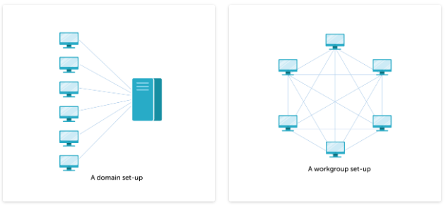
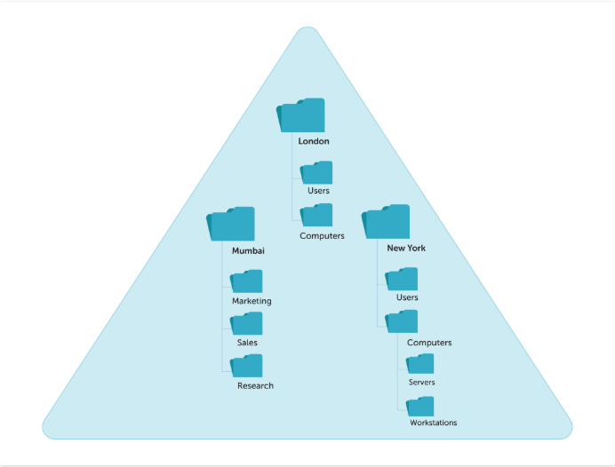

#  Identity Management

## Article - Active Directory 360: Fundamentals of Active Directory, Workgroups and Domains
- The five srevices that runs on Windows Server
    - AD domain service (AD DS)
    - AD lightweight directory service
    - AD federation service(AD FS)
    - AD certificate service (AD CS)
    - AD Rights Management services (AD RMS)
- ADDS
    - store of information like telephone directory
    - AD is not a database, rather it is directory that points to database. 
    - When deploying AD, one should consider two things
        - Logical and physical
            - Logical side: this is the hierarchy of objects such as users, computer, groups and organizational units.
        - Physical side: admin has to think about servers that provide the AD service and contain all the critical information
-  Workgorup vs domains
    - A workgroup is a peer to peer network with no central authentication. When user wants to get a file from other computer, they need to create username and password on the other user's computer.
    - Workgroup is great in a way that small office with 15 or less computers. 
    - For bigger scale, client-server network environment is more preferred.
    
- Domain service provides more flexibility in a way that when user or groups of users want to access another computer on the domain, they don't need to create another account on that computer
- All of the authentication and authorization is done by domain controller
    - Authentication: The client and server authenticate each other to verify who the user or system is.
    - Authorization: The server determines if the client has the required permissions to access a resource.
- Authentication is processed by Kerberos authentication protocols. Authorization is processed by Access Control Lists(ACLs). 

---

## The structures and benefits of organizational units

- Organizational units (OUs)
    - OU is container within domain that holds users, groups and computers, and other objects. 
    - OU is used to store similar objects
    - Example of OU
        
- Some of the questions to ask while designing the OU
    - Will the OU have a special administrator? if so, who is it?
    - What privileges should the OU's administrator have?
    - how are people going to use the OU?
    - how many OUs, do you really need for your company?
- The benefit of using OUs
    1. Manage objects efficiently: put similar files or object into same directory.
    2. Deploy Group Policy Object (GPO) settings: You can configure particular setting and apply to OU
    3. Delegate administrative control: using the feature you can delegate task to other people when it is needed.

---

## Manager Role Based Access Control with Server Manager
- [To Create a Role](https://docs.microsoft.com/en-us/windows-server/networking/technologies/ipam/create-a-user-role-for-access-control)
- [To create an Access policy](https://docs.microsoft.com/en-us/windows-server/networking/technologies/ipam/create-an-access-policy)
- [Set Access Scope for a DNS Zone](https://docs.microsoft.com/en-us/windows-server/networking/technologies/ipam/set-access-scope-for-a-dns-zone)
- [Set Access Scope for DNS Resource Records](https://docs.microsoft.com/en-us/windows-server/networking/technologies/ipam/set-access-scope-for-dns-resource-records)
- [View Roles and Role Permissions](https://docs.microsoft.com/en-us/windows-server/networking/technologies/ipam/view-roles-and-role-permissions)