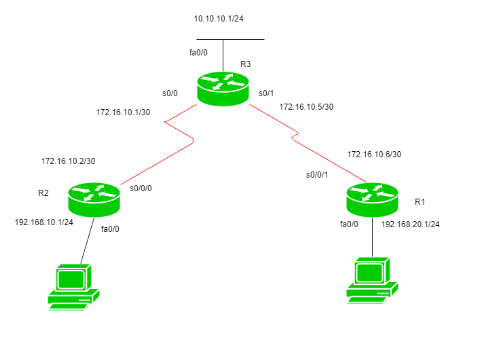
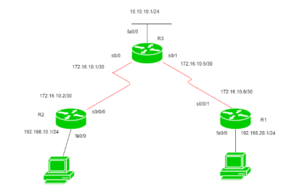

#  OSPF Routing

## What is Routing?
- Routing is process which performed by layer 3 (network layer from OSI) in order to use optimal path from one network to another
- Three types of routing
    1. Static routing
        - Manually add routes in routing table
        - Advantage:
            - Cheaper router can be used to routing
            - Adds security as only admin can allow routing to particular network only
            - No bandwidth usage
        - Disadvantage 
            - Hectic for admin to manually add each route for the network in routing table on each other
            - Admin should have good knowledge of the topology.
        
    2. Default routing
        - Router is configured to send all packets towards a single router.
        - This is usually configured with `stub router`. A `stub router` allows only one route to reach all other networks.
        
    3. Dynamic Routing
        - Dynamic routing uses protocols to discover network destination and the routes to reach it.
        - Automatic adjustment is made when one goes down
        - router should have same dynamic protocol running in order to exchange routes
        - When a router finds a change in topology then router advertises it to all other routers
        - Advantage
            - easy to configure
            - More effective at choosing the best route to destination remote network
        - Disadvantage
            - Consumes more bandwidths
            - Less secure than static routing.

---

## What is Open Shortest Path First (OSPF)?
- Is used to distribute IP routing info throughout a single Autonomous System (AS) in an IP network.
- 