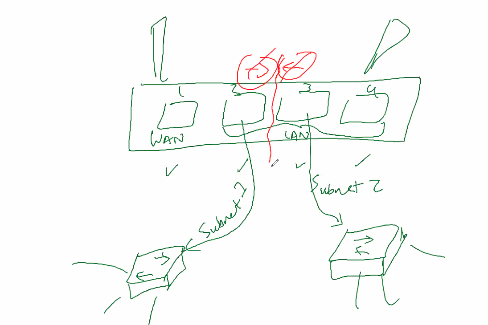

azure fundamental
aws cloud practitional
Devops engineer

Segmenting 
    - reduce congestion and traffic
    - too much can impact traffic
    - Segment off network from harmful traffic
    - achieve regulatory  scope of compliance issue
- isolate the devices into better security
- Scenario 

- industrial example
- 
- whats the disadvantage of having OT and IT not separated
    - OT is very low def
    - 
- Three components
    - BYOD/IOT, IT, OT
- stuxnet
    - sand worm

- UTM firewall
- pFsense open source router firewall
- sonicwall

- physical

- network access control system: NACs
    - cisco design engine

- mirco segmentation - 
- Logical: software based 
    - VLAN 
    - Zones
    - Firewall config
    - Virtual Local area network
    - VLAN it is big task
    - Cisco trust sec
    - gardicore
- physical ports and devices
    - interface 1 with other 
- for interface settings
    - you have to give category
- full duplex can be incoming and outgoing 
- 