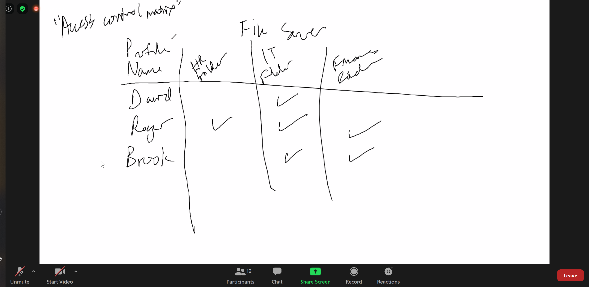

access power shell ise in gns3 windows server
adds new user to the domain

identity management trescends 
- RBAC  role based access control
    - Shipping clerk
    - a role has access to XYZ
    - creating a template that you used to add new identity
- ABAC - attribute based access control
    - Instead of listing role to system, we will have people
    - Manually permission to the identity
- turn over is high then RBAC is better
    - rotating the role is easy
    - demonstrate compliance
    - show template you use
- only do ABac if its really needed
- Start with ABC
- Promote and you still have access to old role
- Priviledge creep: not revoking previous previledge
- principle of least previlege
- lowest prinicple of previledge to the person accordingly
- attribute based
- access control matrix:

- the control panel is join in group
- explicit allow: when you allow the user to have access
- ADAC, Active directory adminitor center
    - control panel that specific
- Organization unit - group A, Group b
    - ou can be site or anything
- ADAC element
    - ou
        - configure security policy by computer
        - 
    - group
    - user

- Disgruntle employee
    - auditor is going to 
- RBAC speeds the whole process up
- Account provisioning
- Account review
- Account revocation
- Windows computer = server
    - run gpedit.mfc
    - group policy editor

- group policy is domain control to computer