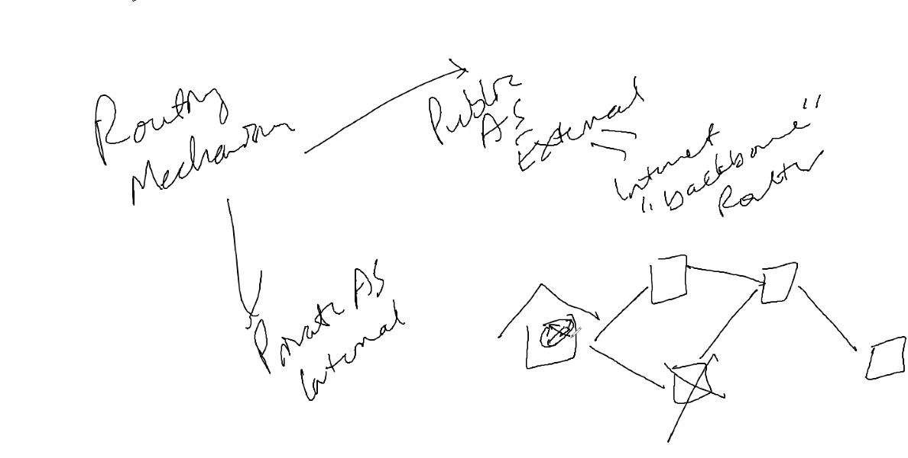

static is first then default configuration

1. static is manual part of car
2. dyanamic is more labor intensive

conversion: time it take for routing table to 
    - if you have good conversion and accuracy and update the path went its down

accuracy: 

fast conversion time : good
accuracy: they save what the data went last time and they use that info next time
- There are two routing mechanism
    - private AS: internal

    - public AS: external, backbone

- routing is changing in the path
- for the routing to correct itself it takes few hours
- Cyberjob description: internal protocol  vs external
- border gateway protocol: external
- Open shortest path first(OSPF): internal
- Administrative distance: the level of power neighbor recieve from neighboring router
- matric: simultaneously running router than it iwll tel which way would better to go
- distance vector: rip 
- get static route
- try to see allowing the ping port to work
- 