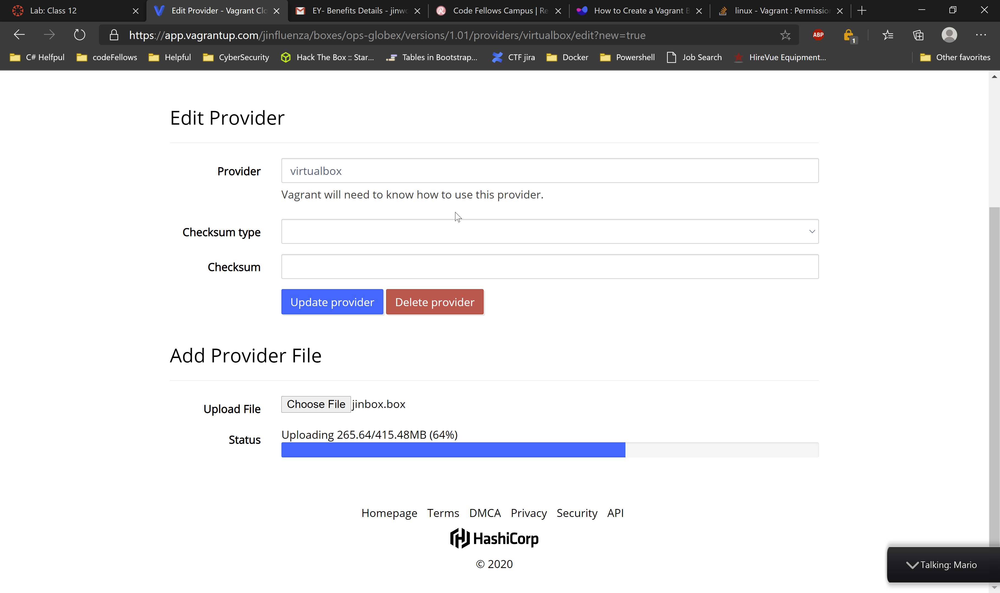

Vagrant Box

1. Install vagrant on your computer 

2. Pull down the boxes from the vagrant by using:
	```
    vagrant init ubuntu/trusty64
    vagrant up 
    ```
3. Run `sudo apt-get update`


4. Upgrade the apt package manager by `sudo apt-get upgrade`


5. Shell into the VM by using vagrant SSH


6. Run couple of commands including
    ```
    sudo apt-get install apache2
    sudo apt-get install mysql-server libapache2-mod-auth-mysql php5-mysql
    sudo mysql_install_db
    sudo /usr/bin/mysql_secure_installation
    sudo apt-get install php5 libapache2-mod-php5 php5-mcrypt
    sudo apt-get install php5-cgi php5-cli php5-curl php5-common php5-gd php5-mysql
    sudo service apache2 restart
    ```


7. After container is packaged


8. Upload it to the Vagrant box using the provider


The screenshot of successfully loading it to other machine


